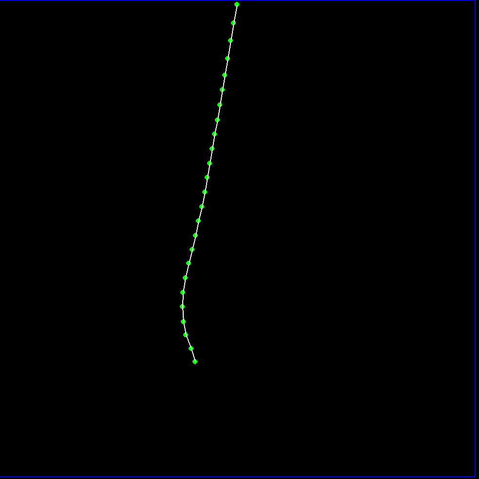

# **Pygame Rope Simulation**

A simple 2D physics simulation of a rope using individual particles and simple attraction and repulsion in Pygame. 
This project was a fun exercise to explore how basic rules of attraction and repulsion, combined with constraints, could create a realistic-looking rope with tension and elasticity. While the simulation isn't physically accurate and has several limitations, it provides an interesting visual representation of these concepts.

---

### Features

- **Particle-based physics**: The rope is made of individual particles.
    
- **Spring-like forces**: Adjacent particles are linked by forces that attract and repel them, emulating the tension and elasticity of a real rope.
    
- **Gravity**: A constant downward force is applied to all but the anchor particle, giving the rope its natural hanging shape.
    
- **Modular code**: The `Particle` class encapsulates the physics logic for each individual node, making the code organized and easy to read.
    

---

### Limitations

- **Performance**: The performance degrades with a large number of particles.
    
- **Not physically accurate**: The forces and movements are based on simplified rules, not precise physical equations.
    
- **Instability**: The simulation can become unstable and "break" if the rope collides with the edges too forcefully.
    
- **Hard-coded anchor points**: The anchor points of the rope must be manually defined in the code.
    
---
### Sample images:

---
### How to Run

1. **Install Pygame**: If you don't have it installed, open your terminal or command prompt and run:
    `pip install pygame`
    	
2. **Save the code**: Save the provided Python code as a `.py` file (e.g., `main.py`).

3. **Run the simulation**: Navigate to the directory where you saved the file and run the following command:
	`python main.py`
